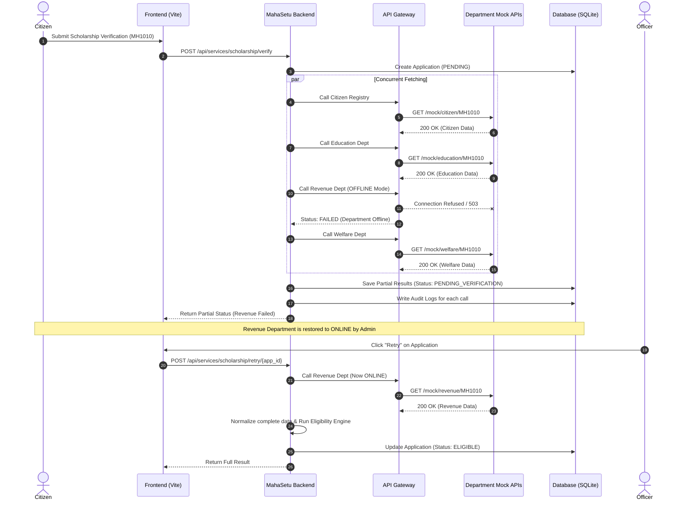

# MahaSetu — Architectural Specification

> **SIH 2026 | Problem Statement #129 | Government of Maharashtra**  
> **Secure Government Digital Interoperability & Service Orchestration Platform**

---

## 1. High-Level Architecture Overview

MahaSetu is designed to address the challenge of siloed, incompatible digital platforms across government departments. It acts as an intelligent interoperability and service orchestration layer that enables seamless, real-time cross-departmental data retrieval, schema transformation, deterministic eligibility verification, and tamper-evident audit trail maintenance.

```
┌───────────────────────────────────────────────────────────────────────┐
│                           PRESENTATION LAYER                          │
│                                                                       │
│     ┌──────────────────────────────────────────────────────────┐      │
│     │                 React + TypeScript + Vite                │      │
│     │               Single-Page Application (SPA)              │      │
│     │   - Citizen Portal  - Officer Dashboard  - Admin Portal  │      │
│     └────────────────────────────┬─────────────────────────────┘      │
└──────────────────────────────────┼────────────────────────────────────┘
                                   │ HTTPS / REST (JWT Bearer Token)
┌──────────────────────────────────▼────────────────────────────────────┐
│                             BACKEND ENGINE                            │
│                                                                       │
│  ┌─────────────────────────────────────────────────────────────────┐  │
│  │                    FastAPI Core & Middleware                    │  │
│  │  - CORS Middleware      - Bearer Auth Handler                   │  │
│  │  - Sliding Window Rate Limiter (20 req/min/user)                 │  │
│  │  - Custom Exception Handlers                                    │  │
│  └────────────────────────────────┬────────────────────────────────┘  │
│                                   │                                   │
│  ┌────────────────────────────────▼────────────────────────────────┐  │
│  │                     Orchestration Engine                        │  │
│  │  - Async / Concurrent Department Gateway Calls                  │  │
│  │  - Partial Failure Handling & Recovery                         │  │
│  │  - Resilient Retry Handler                                      │  │
│  └────────────────────────────────┬────────────────────────────────┘  │
│                                   │                                   │
│  ┌────────────────────────────────▼────────────────────────────────┐  │
│  │                  API Gateway & Adapter Layer                    │  │
│  │  - Inter-service Authentication (X-MahaSetu-Key)               │  │
│  │  - Circuit-Breaker Simulation (OFFLINE / SLOW department states)│  │
│  └───────┬───────────────┬────────────────┬───────────────┬────────┘  │
│          │               │                │               │           │
│  ┌───────▼──────┐ ┌──────▼───────┐ ┌──────▼──────┐ ┌──────▼──────┐    │
│  │   Citizen    │ │  Education   │ │   Revenue   │ │   Welfare   │    │
│  │  Registry    │ │ Department   │ │ Department  │ │ Department  │    │
│  └───────┬──────┘ └──────┬───────┘ └──────┬──────┘ └──────┬──────┘    │
│          └───────────────┴────────┬───────┴───────────────┘           │
│                                   │ Raw Responses (Heterogeneous)     │
│  ┌────────────────────────────────▼────────────────────────────────┐  │
│  │                    Schema Normalization Engine                  │  │
│  │  - Maps heterogeneous department JSON to NormalizedCitizenData │  │
│  │  - Automated field conversion & standard validation             │  │
│  │  - Fuzzy Name Matching (Levenshtein Distance Detection)         │  │
│  └────────────────────────────────┬────────────────────────────────┘  │
│                                   │ Normalized Data Model             │
│  ┌────────────────────────────────▼────────────────────────────────┐  │
│  │                   Eligibility Rules Engine                      │  │
│  │  - Deterministic evaluation logic (Income, Marks, Prior Benefit)│  │
│  │  - Granular rejection reason accumulation                       │  │
│  └────────────────────────────────┬────────────────────────────────┘  │
│                                   │ Application Result + Audit Data   │
│  ┌────────────────────────────────▼────────────────────────────────┐  │
│  │                    Persistence Layer (SQLite DB)                │  │
│  │  - SQLAlchemy 2.0 Async ORM                                     │  │
│  │  - User, Application, AuditLog, SystemStatus Entities          │  │
│  └─────────────────────────────────────────────────────────────────┘  │
└───────────────────────────────────────────────────────────────────────┘
```

---

## 2. Core Technical Components

### 2.1 API Gateway & Inter-Service Security
- **Authentication**: JWT HS256 tokens issued on `/api/auth/login`. Expiration defaults to 60 minutes.
- **Inter-service Security**: Department APIs require an internal API key passed in the header `X-MahaSetu-Key`.
- **Fault Simulation**: Admin can toggle any department's state (`ONLINE`, `OFFLINE`, `SLOW`) to test system resilience and partial failure fallback.

### 2.2 Schema Normalization Layer
The core innovation of MahaSetu is translating siloed, department-specific schemas into a unified internal model (`NormalizedCitizenData`).

| Department | Source Field | Target Internal Field | Description / Type |
|---|---|---|---|
| Citizen Registry | `citizen_id` | `citizen_id` | Unique Identifier (String) |
| Citizen Registry | `full_name` | `full_name` | Citizen Full Name (String) |
| Citizen Registry | `district_name` | `district` | District Location (String) |
| Education Dept | `student_id` | `student_id` | Student Roll Number (String) |
| Education Dept | `institution_name` | `college_name` | Educational Institution (String) |
| Education Dept | `percentage` | `marks_percentage` | Academic Marks % (Float) |
| Revenue Dept | `income_yearly` | `annual_income` | Family Income in INR (Float) |
| Revenue Dept | `certificate_no` | `income_certificate_no` | Revenue Cert # (String) |
| Welfare Dept | `already_received` | `already_received_benefit` | Prior Scheme Benefit (Boolean) |

### 2.3 Eligibility Rules Engine
Eligibility rules are strictly deterministic to guarantee fairness, transparency, and auditability.
- **Income Limit**: `annual_income < ₹2,50,000`
- **Academic Merit**: `marks_percentage >= 60.0%`
- **Prior Benefit**: `already_received_benefit == False`

### 2.4 Name Mismatch AI Detector
To detect identity fraud across disparate systems, MahaSetu computes a normalized string similarity (Levenshtein ratio) between the name in the Citizen Registry and the name in the Education Department. If similarity is between 60% and 95%, a `NAME_MISMATCH` flag is logged and flagged for manual review.

---

## 3. Resilience & Partial Outage Recovery Workflow



---

## 4. Role-Based Access Control (RBAC)

| Role | Operational Scope |
|---|---|
| **Citizen** | Can verify own eligibility, view own submitted applications and live status. Cannot access officer stats or administrative system toggles. |
| **Officer** | Can view all citizen applications, filter by status/district, view raw verification logs, and trigger retries for incomplete verifications. |
| **Admin** | Full access including system status control (simulate system offline/slow states), audit log inspection, and system metrics. |

---

## 5. Security & Compliance Architecture

1. **Tamper-Evident Audit Logging**: Every outbound API request records timestamp, user ID, department name, target endpoint, status code, latency, and purpose.
2. **Data Minimization**: API endpoints return only fields essential for service evaluation.
3. **Strict Validation**: All endpoints accept Pydantic typed input models to prevent injection attacks.
